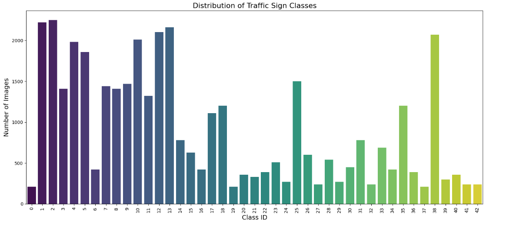

# Traffic-Sign-Classification Using Convolutional Neural Networks
Traffic Sign Classification for Smarter Cars

## Overview
This project tackles the problem of traffic sign classification. The goal is to automatically recognize and label images into one of 43 distinct classes using deep learning. Two distinct convolutional neural network (CNN) models were built, trained, and evaluated. The work involved data preprocessing (including balancing, resizing, and normalization), model design, training, evaluation, and testing on real-world images.

## Dataset, Preprocessing and Exploratory Data Analysis
The dataset came in a zipped format and comprises images of traffic signs organized into 43 classes. Each class had uneven number of images, ranging from *2,250 images* in one class to *210 images in others*. The dataset also included the labels of each of those classes in separate tables.

## Exploratory Data Analysis (EDA)
Before building the CNN models, an exploration of the dataset was performed to better understand its characteristics and ensure data consistency.

1. **Visual Inspection of Images:**
After unzipping the dataset, a grid of sample images was displayed to inspect the quality and variability across the dataset. For example, 12 random images from the test folder were plotted to ensure that the images captured real-life traffic sign scenarios nd also revealed some of its dimensions.

*sample images*
```python
# Plotting 12 images to check dataset
plt.figure(figsize=(12,12))
path = "traffic_sign_dataset/Test"
for i in range(1,17):
    plt.subplot(4,4,i)
    plt.tight_layout()
    rand_img = imread(path +'/'+ random.choice(sorted(os.listdir(path))))
    plt.imshow(rand_img)
    plt.xlabel(rand_img.shape[1], fontsize = 10)#width of image
    plt.ylabel(rand_img.shape[0], fontsize = 10)#height of image
```
*output*


2. **Analysis of Image Dimensions:**
Since the images were originally of varying dimensions as revealed in the grid of the sample images, an analysis was conducted to compute the mean width and height of the images. This information guided the decision to resize all images to 50×50 pixels.

*Taking the mean of the dimensions and printing them*
```python
dim1 = []
dim2 = []

for i in range(0,43):
    labels = 'traffic_sign_dataset/Train' + '/{0}'.format(i)
    image_path = os.listdir(labels)
    for x in image_path:
        img = imread(labels + '/' + x)
        dim1.append(img.shape[0]) #height
        dim2.append(img.shape[1]) #width

#Printing mean dimension of images
print("Mean Height: ",np.mean(dim1), "Mean Width: ",np.mean(dim2))
```
The resulting averages were approximately **50.33** and **50.84** respectively, confirming the suitability of a **50:50** target size.

3. **Class Distribution Analysis**
Plotting the distribution of the images per class provided insights into the data balance. Although the original dataset had variability in counts per class, subsequent balancing ensured an equal number of images in each category. The highest count was 2,250 images while the lowest was 210. Undersampling was carried out across classes based on the lowest class size.

*Distribution of Traffic Sign Classes*
```python
#Visualize the number of classes count with a beautiful plot
plt.figure(figsize=(15, 7))
sns.countplot(x=label_id, palette='viridis') # Using viridis palette for a nicer look
plt.title('Distribution of Traffic Sign Classes', fontsize=16)
plt.xlabel('Class ID', fontsize=14)
plt.ylabel('Number of Images', fontsize=14)
plt.xticks(rotation=90) # Rotate x-axis labels for better readability
plt.tight_layout() # Adjust layout to prevent labels overlapping
plt.show()
```
*output*


## Data Preprocessing
Key preprocessing steps included are:
- **Data Balancing:**
To prevent class bias, the dataset was balanced by undersampling an equal number of images from each class, based on the least number of classes which was *210*.
*Undersampling the dataset*
```python
insert code
```
- **Image Resizing and Normalisation:**
After taking the mean of the dimensions of all the images in the dataset, every image was resized to a uniform dimension of 50×50 pixels. Pixel values were then normalized by dividing by 255 to scale them between 0 and 1.
*Resizing and normalising images*
```python
insert code
```
- **Train-Test Split:**
An 80/20 split was performed to create training and validation sets.
*splitting dataset for training*
```python
insert code
```

## Model Architectures - Training and evaluation
Two CNN models were developed for this classification task. Both models share a similar pipeline consisting of convolutional layers, pooling layers, dropout layers for regularization, and dense layers for final classification. The details of each are outlined below.

# Training and Evaluation
Both models were trained for 50 epochs with the following common procedure. Here is an example training code snippet for Model 1:
```python
history = model.fit(x_train, y_train,
                     epochs=50,
                     validation_data=(x_test, y_test),
                     verbose=2)
```

### Evaluating the model on the test set
```python
loss, accuracy = model2.evaluate(x_test, y_test)
print('Model 1 Accuracy: {:.2f}%'.format(accuracy * 100))
```

### Evaluation Metrics
After training, the models were evaluated using a confusion matrix and a detailed classification report, outputs presented below each model architecture.

## Model 1 Architecture, Training and Evaluation
Architecture Details:
- Input:
Images of shape (50, 50, 3).
- Convolutional Block 1:
A single Conv2D layer with 64 filters, a 3×3 kernel, ReLU activation, and "same" padding for consistent dimensions.
Followed by a 2×2 MaxPooling layer and a dropout layer (rate 0.5).
- Convolutional Block 2:
A second Conv2D layer with 64 filters and a 3×3 kernel.
Followed by another 2×2 MaxPooling and dropout (rate 0.5).
- Classification Block:
A Flatten layer converts the pooled feature maps into a vector.
A Dense layer with 128 neurons (ReLU) is added, followed by dropout (rate 0.5), and finally, a Dense layer with Softmax activation for 43-class classification.

*Code Snippet for Model 1*
```python
model = Sequential()
model.add(Conv2D(filters=64, kernel_size=(3,3), activation='relu', padding='same', input_shape=x_train.shape[1:]))
model.add(MaxPool2D(pool_size=(2,2)))
model.add(Dropout(0.5))
model.add(Conv2D(filters=64, kernel_size=(3,3), activation='relu'))
model.add(MaxPool2D(pool_size=(2,2)))
model.add(Dropout(0.5))
model.add(Flatten())
model.add(Dense(128, activation='relu'))
model.add(Dropout(0.5))
model.add(Dense(43, activation='softmax'))

model.compile(loss='sparse_categorical_crossentropy', optimizer='adam', metrics=['accuracy'])
model.summary()
```
*Architecture Summary for Model 1:*


Results:
- Validation Accuracy: Approximately 98.45%.
- Similar convergence behavior was observed with a higher initial loss that quickly decreased.

*Classification Report (Model 1)*

|      | precision | recall | f1-score | support |
| ----------- | ----------- | ----------- | ----------- | ----------- |
| accuracy |    |    | 0.98 | 1806 |
| macro avg | 0.99 | 0.99 | 0.99 | 1806 |
| weighted avg | 0.99 | 0.98 | 0.98 | 1806 |


*Model 1 Loss and Accuracy Plots*


*Model 1 Confusion Matrix*


## Model 2 Architecture, Training and Evaluation
Architecture Details:
- Input:
Image shape of (50, 50, 3).
- Convolutional Block 1:
Two Conv2D layers with 32 filters and a 5×5 kernel, both using ReLU activation.
Followed by a 2×2 MaxPooling layer and a dropout layer (rate 0.25).
- Convolutional Block 2:
Two Conv2D layers with 64 filters and a 3×3 kernel (ReLU activation).
Followed by another 2×2 MaxPooling and dropout (rate 0.25).
- Classification Block:
A Flatten layer converts feature maps into a 1D vector.
A Dense layer with 256 neurons (ReLU) is applied, followed by dropout (rate 0.5).
The final Dense layer uses a softmax activation for 43-class prediction.
Code Snippet for Model 1
from tensorflow.keras.models import Sequential
from tensorflow.keras.layers import Conv2D, MaxPool2D, Dropout, Flatten, Dense

**code snippet for Model2**

```python
model2 = Sequential()
model2.add(Conv2D(filters=32, kernel_size=(5,5), activation='relu', input_shape=x_train.shape[1:]))
model2.add(Conv2D(filters=32, kernel_size=(5,5), activation='relu'))
model2.add(MaxPool2D(pool_size=(2, 2)))
model2.add(Dropout(rate=0.25))

model2.add(Conv2D(filters=64, kernel_size=(3, 3), activation='relu'))
model2.add(Conv2D(filters=64, kernel_size=(3, 3), activation='relu'))
model2.add(MaxPool2D(pool_size=(2, 2)))
model2.add(Dropout(rate=0.25))

model2.add(Flatten())
model2.add(Dense(256, activation='relu'))
model2.add(Dropout(rate=0.5))
model2.add(Dense(43, activation='softmax'))

#Compiling the model
model2.compile(loss='sparse_categorical_crossentropy', optimizer='adam', metrics=['accuracy'])
model2.summary()
```

*Architecture Summary (Model 2):*


Results:
- Validation Accuracy: Approximately 99.06%.
- Loss and accuracy curves showed steady convergence over 50 epochs.

*Classification Report (Model 2)*

|      | precision | recall | f1-score | support |
| ----------- | ----------- | ----------- | ----------- | ----------- |
| accuracy |    |    | 0.99 | 1806 |
| macro avg | 0.99 | 0.99 | 0.99 | 1806 |
| weighted avg | 0.99 | 0.99 | 0.99 | 1806 |

*Model 2 Loss and Accuracy Plots*


*Model 2 Confusion Matrix*


# Testing with New Images
A custom prediction pipeline was developed to scale and predict on new traffic sign images. The following code snippet shows how a test image is processed and evaluated:

```python
import random
from PIL import Image
import matplotlib.pyplot as plt

def scaling(test_images, test_path):
    images = []
    for x in test_images:
        img = Image.open(test_path + '/' + x)
        img = img.resize((50,50))
        img = np.array(img)
        images.append(img)
    return np.array(images) / 255  # normalization


test_images = scaling(sorted(os.listdir(test_path)), test_path)

# Select a random image
random_index = random.randint(0, len(test_images) - 1)
random_image = test_images[random_index].reshape(1, 50, 50, 3)

prediction_model2 = model2.predict(random_image)
predicted_class_model2 = np.argmax(prediction_model2, axis=1)
```

```python
# Mapping of class indices to traffic sign labels
all_labels = ['Speed limit (20km/h)', 'Speed limit (30km/h)', 'Speed limit (50km/h)', 'Speed limit (60km/h)', 
              'Speed limit (70km/h)', 'Speed limit (80km/h)', 'End of speed limit (80km/h)', 'Speed limit (100km/h)', 
              'Speed limit (120km/h)', 'No passing', 'No passing for vehicles over 3.5 metric tons',
              'Right-of-way at the next intersection', 'Priority road', 'Yield', 'Stop',
              'No vehicles', 'Vehicles over 3.5 metric tons prohibited', 'No entry', 'General caution',
              'Dangerous curve to the left', 'Dangerous curve to the right', 'Double curve', 'Bumpy road',
              'Slippery road', 'Road narrows on the right', 'Road work', 'Traffic signals', 'Pedestrians',
              'Children crossing', 'Bicycles crossing', 'Beware of ice/snow', 'Wild animals crossing',
              'End of all speed and passing limits', 'Turn right ahead', 'Turn left ahead', 'Ahead only',
              'Go straight or right', 'Go straight or left', 'Keep right', 'Keep left', 'Roundabout mandatory',
              'End of no passing', 'End of no passing by vehicles over 3.5 metric tons']

print("True Label:", all_labels[y_test[random_index]])
print("Model 1 Prediction:", all_labels[np.argmax(model.predict(random_image), axis=1)[0]])
print("Model 2 Prediction:", all_labels[predicted_class_model2[0]])

# Display the image
plt.imshow(test_images[random_index])
plt.title("Traffic Sign Test Image")
plt.show()
```


Insert a sample test image with prediction results here.
#explain the two sample codes above in detail.

display 

# Conclusion
Two different CNN architectures were developed for traffic sign classification.
- Model 1 (with two stacks of convolutional layers and extensive dropout) achieved a validation accuracy of approximately 99.06%.
- Model 2 (a slightly simpler architecture with 64-filter layers and high dropout rates) achieved around 98.45% accuracy.
Future work could incorporate further hyperparameter tuning, data augmentation techniques, and real-time integration to enhance performance even further.


# Conclusion (expand on the conclusion - include why model 2 performed better than 1)
Two distinct CNN architectures were developed for traffic sign classification:
- Model 1: Achieved a validation accuracy of approximately 98.45%.
- Model 2: Achieved a validation accuracy of approximately 99.06%.
Both models showed robust performance, with steady convergence and high precision across 43 classes. Future enhancements could include hyperparameter tuning, data augmentation, and real-time implementation to further improve performance.


***###Traffic Sign Classification
Traffic Sign Classification Using Convolutional Neural Networks
Overview
This project tackles the problem of traffic sign classification with the objective of automatically recognizing and labeling images into one of 43 distinct classes. Two different convolutional neural network (CNN) models were developed—each with its own architecture design—and trained and evaluated using TensorFlow and Keras. The workflow involved extensive data preprocessing (balancing, resizing, and normalization), model design, training, performance evaluation, and testing on real-world images.
Dataset and Preprocessing
The dataset contains traffic sign images spanning 43 classes. Key preprocessing steps included:
- Data Balancing:
To prevent class bias, an equal number of images were sampled from each category.
- Image Resizing and Normalization:
Every image was resized to a uniform size of 50×50 pixels. The pixel values were normalized by dividing by 255 to scale the intensity values between 0 and 1.
- Train-Test Split:
An 80/20 split was performed to create training and validation sets.
Sample Preprocessing Code
import os
import numpy as np
from PIL import Image

# Function to preprocess an image: resize and normalize
def preprocess_image(image_path, size=(50,50)):
    img = Image.open(image_path)
    img = img.resize(size)
    img = np.array(img)
    return img / 255

# Example usage:
sample_image = preprocess_image('path/to/sample_image.png')


<!-- Insert sample preprocessed image below -->
Sample Preprocessed Image

Model Architectures
Two distinct CNN models were developed. Both share a pipeline that includes convolutional layers, pooling layers, dropout for regularization, and dense layers for final classification. Their configurations differ as outlined below.
Model 1 (Referred to as Model2)
Architecture Details
- Input:
Images are fed as (50, 50, 3) tensors.
- Convolutional Block 1:
- Two Conv2D layers with 32 filters and a kernel size of 5×5, each using ReLU activation.
- A MaxPooling2D layer with a pool size of 2×2.
- A Dropout layer with a rate of 0.25.
- Convolutional Block 2:
- Two Conv2D layers with 64 filters and kernel size 3×3, with ReLU activation.
- Followed by another MaxPooling2D layer (2×2) and Dropout (0.25).
- Classification Block:
- A Flatten layer converts the feature maps into a 1D vector.
- A Dense layer with 256 neurons and ReLU activation.
- A Dropout layer (rate 0.5) to prevent overfitting.
- A final Dense layer with 43 neurons and Softmax activation for multi-class classification.
Code Snippet for Model 1
from tensorflow.keras.models import Sequential
from tensorflow.keras.layers import Conv2D, MaxPool2D, Dropout, Flatten, Dense

model2 = Sequential()
model2.add(Conv2D(filters=32, kernel_size=(5,5), activation='relu', input_shape=x_train.shape[1:]))
model2.add(Conv2D(filters=32, kernel_size=(5,5), activation='relu'))
model2.add(MaxPool2D(pool_size=(2, 2)))
model2.add(Dropout(rate=0.25))

model2.add(Conv2D(filters=64, kernel_size=(3, 3), activation='relu'))
model2.add(Conv2D(filters=64, kernel_size=(3, 3), activation='relu'))
model2.add(MaxPool2D(pool_size=(2, 2)))
model2.add(Dropout(rate=0.25))

model2.add(Flatten())
model2.add(Dense(256, activation='relu'))
model2.add(Dropout(rate=0.5))
model2.add(Dense(43, activation='softmax'))

model2.compile(loss='sparse_categorical_crossentropy', optimizer='adam', metrics=['accuracy'])
model2.summary()


Architecture Summary
| Layer Type | Output Shape | Parameters | 
| Conv2D (32 filters, 5×5) | (46, 46, 32) | 2,432 | 
| Conv2D (32 filters, 5×5) | (42, 42, 32) | 25,632 | 
| MaxPooling2D (2×2) | (21, 21, 32) | 0 | 
| Dropout (0.25) | (21, 21, 32) | 0 | 
| Conv2D (64 filters, 3×3) | (19, 19, 64) | 18,496 | 
| Conv2D (64 filters, 3×3) | (17, 17, 64) | 36,928 | 
| MaxPooling2D (2×2) | (8, 8, 64) | 0 | 
| Dropout (0.25) | (8, 8, 64) | 0 | 
| Flatten | (4096,) | 0 | 
| Dense (256 neurons, ReLU) | (256,) | 1,048,832 | 
| Dropout (0.5) | (256,) | 0 | 
| Dense (43 neurons, Softmax) | (43,) | 11,051 | 


Results:
- Validation Accuracy: ~99.06%
- Convergence was observed over 50 epochs with steadily decreasing loss.
<!-- Insert evaluation graphs for Model 1 below -->
Model 1 Loss Curve
Model 1 Accuracy Curve
Model 1 Confusion Matrix

Model 2
Architecture Details
- Input:
Images are passed as (50, 50, 3) tensors.
- Convolutional Block 1:
- A Conv2D layer with 64 filters, a 3×3 kernel, ReLU activation, and "same" padding.
- A MaxPooling2D layer (2×2) follows.
- A Dropout layer with a rate of 0.5.
- Convolutional Block 2:
- A second Conv2D layer with 64 filters and a 3×3 kernel.
- A following MaxPooling2D layer (2×2) and Dropout layer (0.5).
- Classification Block:
- A Flatten layer is applied.
- A Dense layer with 128 neurons, activated by ReLU.
- A Dropout (0.5) layer.
- A final Dense layer with Softmax activation outputs predictions for 43 classes.
Code Snippet for Model 2
model = Sequential()
model.add(Conv2D(filters=64, kernel_size=(3,3), activation='relu', padding='same', input_shape=x_train.shape[1:]))
model.add(MaxPool2D(pool_size=(2,2)))
model.add(Dropout(0.5))
model.add(Conv2D(filters=64, kernel_size=(3,3), activation='relu'))
model.add(MaxPool2D(pool_size=(2,2)))
model.add(Dropout(0.5))
model.add(Flatten())
model.add(Dense(128, activation='relu'))
model.add(Dropout(0.5))
model.add(Dense(43, activation='softmax'))

model.compile(loss='sparse_categorical_crossentropy', optimizer='adam', metrics=['accuracy'])
model.summary()


Architecture Summary
| Layer Type | Output Shape | Parameters | 
| Conv2D (64 filters, 3×3, same padding) | (50, 50, 64) | 1,792 | 
| MaxPooling2D (2×2) | (25, 25, 64) | 0 | 
| Dropout (0.5) | (25, 25, 64) | 0 | 
| Conv2D (64 filters, 3×3) | (23, 23, 64) | 36,928 | 
| MaxPooling2D (2×2) | (11, 11, 64) | 0 | 
| Dropout (0.5) | (11, 11, 64) | 0 | 
| Flatten | (7744,) | 0 | 
| Dense (128 neurons, ReLU) | (128,) | 991,360 | 
| Dropout (0.5) | (128,) | 0 | 
| Dense (43 neurons, Softmax) | (43,) | 5,547 | 


Results:
- Validation Accuracy: ~98.45%
- The model exhibited a rapid decrease in loss early in training.
<!-- Insert evaluation graphs for Model 2 below -->
Model 2 Loss Curve
Model 2 Accuracy Curve
Model 2 Confusion Matrix***

